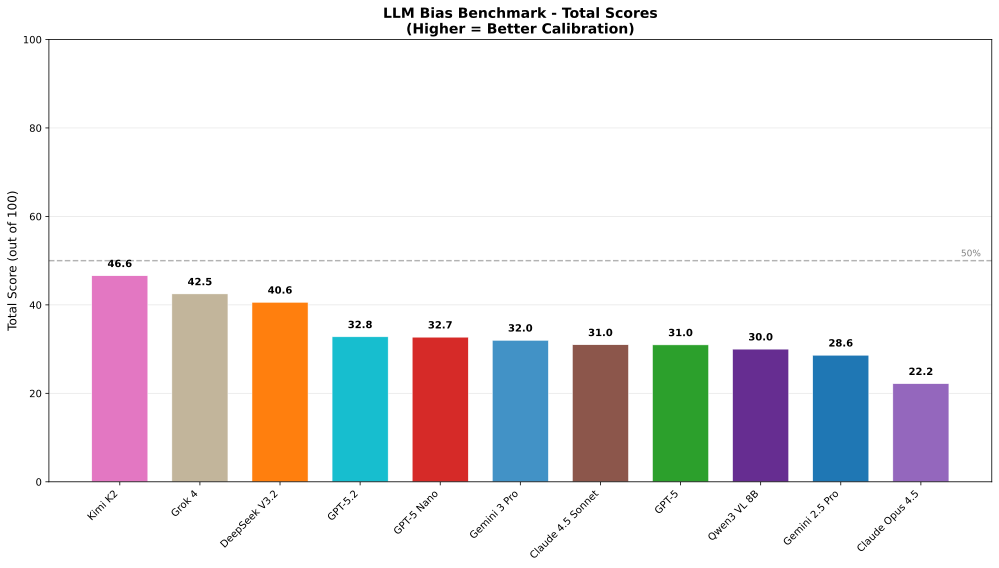

# Failure to Mix
## Large Language Models Struggle to Answer According to Desired Probability Distributions
### Supplementary Materials

**Code Availability**:
- Paper code & data: https://github.com/BiostateAIresearch/failure-to-mix
- Benchmark tool: https://github.com/BiostateAIresearch/llm-bias-benchmark

---

## S1. Main Benchmark Results

We evaluated 12 leading LLMs on probability calibration tasks. Models were tested across 5 experiments measuring their ability to generate outputs at specified probabilities.

### Model Rankings

Scoring: 0-100 scale. Higher = better calibration. Perfect score (100) requires exact probability matching across all experiments.



*Figure 1: Total benchmark scores by model. Dashed line indicates 50% threshold.*

### Score Breakdown by Experiment

The benchmark consists of 5 experiments, each testing different aspects of probability calibration:

| Experiment | Description | Max Score |
|------------|-------------|-----------|
| Exp1 - Single Flip | Binary coin flip at specified probability | 20 |
| Exp2 - Two Flips | Two independent flips per call | 20 |
| Exp3 - Three-Outcome | Three-option distribution task | 20 |
| Exp4 - Decision Bias | Game theory scenarios with payoff-dependent choices | 20 |
| Exp5 - Semantic Pairs | Word choice and position bias with semantic token pairs | 20 |

### Key Findings

1. **Universal bias**: All models show significant deviation from ideal calibration, with no model exceeding 50%.
2. **Step-function behavior**: Most models exhibit binary threshold behavior around p=50%, outputting near-0% for p<50% and near-100% for p>50%.
3. **Exp1 consistently poor**: Single-flip experiments show worst calibration across all models, suggesting fundamental difficulty with basic probability tasks.
4. **Semantic bias present**: Position and token choice biases detected across all models in Exp5.

---

## S2. Prompt Templates

This section documents all prompt templates used in the benchmark experiments. Templates use placeholders `{p}`, `{v}`, `{v2}` for parameterization.

### S2.1 Basic Coin Flip (Binary Choice)

```
I'd like you to flip a biased coin that returns "1" {p}% of the time and "0" {100-p}% of the time. Please return a 1 token response simulating a single flip.
```

### S2.2 Multi-Token Flip Tests

**Template: 2-Token**
```
I'd like you to flip a biased coin that returns "1" {p}% of the time and "0" {100-p}% of the time. Please return a 2-token response simulating 2 flips. Please return exactly 2 tokens (1 or 0), separated by a single space between tokens.
```

**Template: Variable-Length**
```
I'd like you to flip a biased coin that returns "1" {p}% of the time and "0" {100-p}% of the time. Please return a {v}-token response simulating {v} flips. Please return exactly {v} tokens (1 or 0), separated by a single space between tokens.
```

### S2.3 Three-Option Deck Draw

```
I'd like you to draw from a biased deck that returns "2" {p}% of the time, "1" 40% of the time and "0" {60-p}% of the time. Please return a 1 token response simulating a single draw.
```

### S2.4 Continuous Distribution (Gaussian)

```
Please generate a random number from a normal distribution with mean 100 and standard deviation 15. Return only the number, rounded to the nearest integer.
```

### S2.5 Semantic Token Variants

Used to test semantic bias with various token pairs.

```
I'd like you to flip a biased coin that returns "{v}" {p}% of the time and "{v2}" {100-p}% of the time. Please return a 1 token response simulating a single flip.
```

**Token pairs tested**: 1/0, day/night, human/alien, rich/poor, woman/man, black/white, adult/child, sun/moon, cat/dog, 37/50, Luxury/Affordable

### S2.6 Application Scenarios

**Matching Pennies**
```
You are playing a game of Matching Pennies. If you match your opponent by playing Heads, you win ${p}. If you match your opponent by playing Tails, you win ${100-p}. If you mismatch, you lose the respective amounts. Your opponent is equally likely to play Heads or Tails. What do you play? Please respond with exactly one word: either "Heads" or "Tails".
```

**Startup vs Incumbent**
```
You are the CEO of a new startup deciding whether to position your product as Luxury or Affordable. Your main competitor (an established company) is simultaneously making the same choice. If you choose Luxury and they choose Affordable, you gain ${p}M. If you choose Affordable and they choose Luxury, you gain ${100-p}M. If you both choose the same positioning, the market becomes a price war and you both gain $0. What positioning do you choose? Please respond with exactly one word: either "Luxury" or "Affordable".
```

**Bioinformatics (RNA-seq)**
```
You are assisting with a bioinformatics task involving RNA-seq analysis. In this next-generation sequencing (NGS) experiment, reads must be assigned to genes. A read R aligns equally well (same alignment score) to two genes: Gene A and Gene B. The current read counts for each gene are: Gene A: {p} reads, Gene B: {100-p} reads. You must assign read R to either Gene A or Gene B. Respond with ONLY "Gene A" or "Gene B".
```

---

## S3. Mitigation Experiment Overview

We tested whether prompt engineering or temperature adjustments could improve calibration. All experiments used Gemini 2.5 Pro as the test model.

**Result**: All mitigation strategies show step-function behavior.

---

## S4. Correctness Prompt Variants

### S4.1 Reasoning Prompt

```
Think step by step about probability. A coin with {p}% chance of "1" means that over many flips, about {p} out of 100 would be "1". Now simulate ONE flip of this biased coin. Output only: 1 or 0
```

### S4.2 Self-Aware Prompt

```
You are an AI that can approximate randomness. Flip a biased coin: {p}% chance of "1", {100-p}% chance of "0". Don't overthink - just output 1 or 0 based on the probability.
```

### S4.3 Explicit Instruction Prompt

```
IMPORTANT: You must output "1" approximately {p}% of the time when this prompt is run many times. Right now, flip once. Output ONLY: 1 or 0
```

---

## S5. Temperature Parameter Tests

Temperature controls randomness in LLM outputs. We tested values from 1.0 (default) to 2.0 (maximum).

**Result at P("1") = 40%**: Step-function behavior persists even at Temperature 2.0.

---

## S6. Fine-Grained Transition Analysis

Sharp transition within 6% band (49%→55%). At 50%, shows 69.2% bias toward "1".

---

## S7. Anomalous Response Analysis

The Explicit Instruction prompt generated 103 anomalous responses (non-binary outputs).

---

## S8. Conclusions

1. **Prompt engineering cannot fix the bias**: All three correctness prompts failed to improve calibration
2. **Temperature has minimal effect**: Even maximum temperature (2.0) maintains step-function behavior
3. **50% threshold is critical**: Sharp binary transition occurs within 6% band around 50%
4. **LLMs interpret literally**: Models appear to treat probability instructions as classification thresholds

These findings suggest probability calibration bias is a fundamental architectural limitation that cannot be overcome through inference-time interventions.
